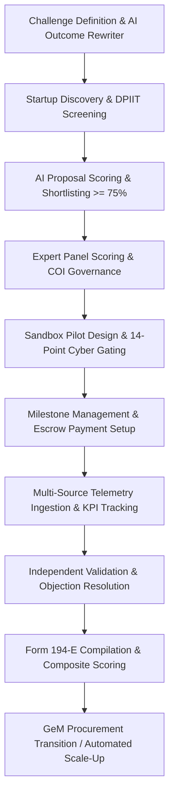
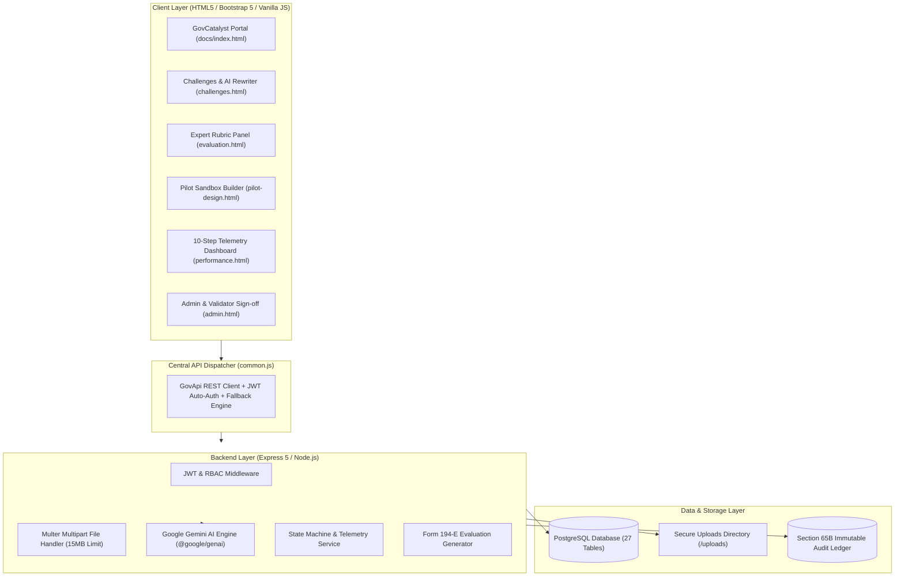

# 🏛️ GovCatalyst (SIH Problem Statement 26136)

> **Empowering Public Sector Innovation** — A Transparent, GFR Rule 194-Compliant Sandbox & Commercial Scale-Up Bridge for Startups and Government Departments.

[](https://govcatalyst.onrender.com)
[](https://tusshar-web.github.io/GovCatalyst/)
[](https://render.com)
[](https://nodejs.org)
[](https://ai.google.dev)
[](#-regulatory--compliance-framework)

---

## 📌 Live Demo Links

| Service | Live Deployment URL | Description |
|---|---|---|
| 🌐 **Fullstack Cloud App (Render)** | [https://govcatalyst.onrender.com](https://govcatalyst.onrender.com) | Express Backend + Static Frontend + PostgreSQL + Multer Uploads |
| 📄 **Frontend Dashboard (GitHub Pages)** | [https://tusshar-web.github.io/GovCatalyst/](https://tusshar-web.github.io/GovCatalyst/) | Static Client connecting to Render Backend REST APIs |
| 🩺 **Backend Health Endpoint** | [https://govcatalyst.onrender.com/api/health](https://govcatalyst.onrender.com/api/health) | Returns `{"success": true, "status": "HEALTHY"}` |

---

## 📖 Executive Summary & Problem Statement

GovCatalyst solves the fundamental friction in public procurement: **How can government departments procure innovative solutions from early-stage startups without violating public tender norms?**

Under standard procurement rules, startups with no 3-year financial track record or turnover are disqualified. Under **General Financial Rules (GFR) Rule 194**, departments are empowered to run **outcome-based sandbox pilots**, evaluate verifiable evidence under independent scrutiny, and transition successful innovations into direct statewide procurement contracts without traditional tender delays.

GovCatalyst automates the entire **10-Step Innovation Procurement Lifecycle**:



---

## 🏗️ System Architecture



---

## ⚖️ Regulatory & Compliance Framework

> [!IMPORTANT]
> GovCatalyst is built specifically to address the regulatory requirements of public sector procurement in India.

### 1. General Financial Rules (GFR) Rule 194 Compliance
Allows government organizations to relax traditional bidding requirements (like minimum experience and past turnover) when procuring innovative solutions from DPIIT-recognized startups. The system validates DPIIT status and ensures that a structured, evidence-backed evaluation is generated.

### 2. Section 65B Indian Evidence Act Compliance
Provides an immutable ledger audit trail for all critical operations: state transitions, score updates, validator verdicts, and telemetry logs. Every action logs the actor's ID, timestamp, old state, and new state.

### 3. Form 194-E Official Certification
Automatically aggregates pilot timelines, KPI results, third-party validation verdicts, and cost metrics into a formal evaluation report. Form 194-E serves as the legal clearance required to skip traditional tenders and list on the Government e-Marketplace (GeM).

---

## 📂 Comprehensive Codebase Tour

### 🌐 Frontend Client Layer (`/docs`)
Contains static dashboard screens built with HTML5, CSS3, and Vanilla JavaScript.

| Filename | Role Access | Purpose & Features |
|---|---|---|
| [`index.html`](file:///c:/Users/tussh/OneDrive/Desktop/govCatalyst/docs/index.html) | Public | Main landing page containing the secure User Login & Registration form. |
| [`admin.html`](file:///c:/Users/tussh/OneDrive/Desktop/govCatalyst/docs/admin.html) | `super_admin` | Controls registration approvals, generates/sends Gmail OTPs, and verifies DPIIT records. |
| [`eligibility.html`](file:///c:/Users/tussh/OneDrive/Desktop/govCatalyst/docs/eligibility.html) | `startup` | Explains tender exemptions. Startup queries mock registry using DPIIT ID to claim exemptions. |
| [`challenges.html`](file:///c:/Users/tussh/OneDrive/Desktop/govCatalyst/docs/challenges.html) | `dept_admin`, `startup` | AI Problem Rewriter & Challenge publisher (dept). Startups view challenges and upload pitches. |
| [`evaluation.html`](file:///c:/Users/tussh/OneDrive/Desktop/govCatalyst/docs/evaluation.html) | `evaluator`, `dept_admin` | Scoring interface. Allows COI declarations, rubric scoring, appeals submission, and decision overrides. |
| [`pilot-design.html`](file:///c:/Users/tussh/OneDrive/Desktop/govCatalyst/docs/pilot-design.html) | `dept_admin` | Configures pilot details, budget, 14-point cybersecurity checklist, and generates bilateral agreements. |
| [`performance.html`](file:///c:/Users/tussh/OneDrive/Desktop/govCatalyst/docs/performance.html) | `dept_admin`, `startup` | Ingests telemetry via MANUAL/CSV/API/IoT, computes RAG statuses, and generates KPI breach alerts. |
| [`milestones.html`](file:///c:/Users/tussh/OneDrive/Desktop/govCatalyst/docs/milestones.html) | `startup`, `validator` | Tracks milestone phases, handles file evidence uploads, and displays third-party validation logs. |
| [`payments.html`](file:///c:/Users/tussh/OneDrive/Desktop/govCatalyst/docs/payments.html) | `dept_admin`, `startup` | Visualizes the smart escrow wallet, payment tranches, and bank transfer reference tokens. |
| [`scaleup.html`](file:///c:/Users/tussh/OneDrive/Desktop/govCatalyst/docs/scaleup.html) | `dept_admin`, `validator` | Generates official Form 194-E report, prints PDF, and handles one-click GeM transition routing. |
| [`startups.html`](file:///c:/Users/tussh/OneDrive/Desktop/govCatalyst/docs/startups.html) | `startup` | Central profile dashboard for startups to update pitch, view bids status, and check verification state. |
| [`common.css`](file:///c:/Users/tussh/OneDrive/Desktop/govCatalyst/docs/common.css) | All | Global CSS styles. |
| [`common.js`](file:///c:/Users/tussh/OneDrive/Desktop/govCatalyst/docs/common.js) | All | Global API Dispatcher containing JWT management, auto-logout hooks, UI alerts, and navbar loaders. |
| [`apiService.js`](file:///c:/Users/tussh/OneDrive/Desktop/govCatalyst/docs/apiService.js) | All | Service wrapper handling HTTP request envelopes for backend communication. |
| [`store.js`](file:///c:/Users/tussh/OneDrive/Desktop/govCatalyst/docs/store.js) | All | Client-side transient state storage system. |

### ⚙️ Backend Server Layer (`/server`)
Express application connected to a PostgreSQL database, orchestrating authentication, file processing, and AI evaluations.

* **`/server/src/app.js`**: Application entry point defining CORS, static routes, health endpoints, and middleware.
* **`/server/src/config/`**:
  * [`db.js`](file:///c:/Users/tussh/OneDrive/Desktop/govCatalyst/server/src/config/db.js): PostgreSQL connection pooling logic.
  * [`autoMigrate.js`](file:///c:/Users/tussh/OneDrive/Desktop/govCatalyst/server/src/config/autoMigrate.js): Runs SQL script sequences on startup and seeds default admin credentials.
* **`/server/src/routes/`**: Handles request dispatching and checks authorizations.
  * [`authRoutes.js`](file:///c:/Users/tussh/OneDrive/Desktop/govCatalyst/server/src/routes/authRoutes.js): Core login, registration, OTP checks, and admin approvals.
  * [`challengeRoutes.js`](file:///c:/Users/tussh/OneDrive/Desktop/govCatalyst/server/src/routes/challengeRoutes.js): AI drafting, publishing, and challenge CRUD actions.
  * [`applicationRoutes.js`](file:///c:/Users/tussh/OneDrive/Desktop/govCatalyst/server/src/routes/applicationRoutes.js): Bid submissions and department bid listings.
  * [`evaluationRoutes.js`](file:///c:/Users/tussh/OneDrive/Desktop/govCatalyst/server/src/routes/evaluationRoutes.js): Rubric definitions, COI flags, scoring, and appeal routes.
  * [`pilot.routes.js`](file:///c:/Users/tussh/OneDrive/Desktop/govCatalyst/server/src/routes/pilot.routes.js): Pilot design parameters, telemetry records, risk logging, and milestone CRUD.
  * [`validationRoutes.js`](file:///c:/Users/tussh/OneDrive/Desktop/govCatalyst/server/src/routes/validationRoutes.js): Independent auditor verifications, validation report submissions, and objections.
  * [`uploadRoutes.js`](file:///c:/Users/tussh/OneDrive/Desktop/govCatalyst/server/src/routes/uploadRoutes.js): Single, multiple, and CSV telemetry file ingestion endpoints.
* **`/server/src/controllers/`**: Implements endpoints' business logic.
  * [`authController.js`](file:///c:/Users/tussh/OneDrive/Desktop/govCatalyst/server/src/controllers/authController.js)
  * [`challengeController.js`](file:///c:/Users/tussh/OneDrive/Desktop/govCatalyst/server/src/controllers/challengeController.js)
  * [`applicationController.js`](file:///c:/Users/tussh/OneDrive/Desktop/govCatalyst/server/src/controllers/applicationController.js)
  * [`evaluationController.js`](file:///c:/Users/tussh/OneDrive/Desktop/govCatalyst/server/src/controllers/evaluationController.js)
  * [`pilot.controller.js`](file:///c:/Users/tussh/OneDrive/Desktop/govCatalyst/server/src/controllers/pilot.controller.js)
  * [`validationController.js`](file:///c:/Users/tussh/OneDrive/Desktop/govCatalyst/server/src/controllers/validationController.js)
* **`/server/src/models/`**: SQL query definitions.
  * Includes query wrappers mapping variables into tables: `userModel.js`, `startupModel.js`, `challengeModel.js`, `applicationModel.js`, `pilot.model.js`, `validation.db.js`, `evaluation.db.js`.
* **`/server/src/services/`**: Integration services.
  * [`aiServices.js`](file:///c:/Users/tussh/OneDrive/Desktop/govCatalyst/server/src/services/aiServices.js): Google Gemini API configurations and prompt formats.
  * [`audit.service.js`](file:///c:/Users/tussh/OneDrive/Desktop/govCatalyst/server/src/services/audit.service.js): Immutable ledger logging helper.
  * [`pilot.service.js`](file:///c:/Users/tussh/OneDrive/Desktop/govCatalyst/server/src/services/pilot.service.js): Helper functions for telemetry ingestion and threshold calculations.
* **`/server/src/utils/`**: Utility scripts.
  * [`stateMachine.js`](file:///c:/Users/tussh/OneDrive/Desktop/govCatalyst/server/src/utils/stateMachine.js): 13-state validation engine.
  * [`emailService.js`](file:///c:/Users/tussh/OneDrive/Desktop/govCatalyst/server/src/utils/emailService.js): SMTP Nodemailer notifications handler.
  * [`validators.js`](file:///c:/Users/tussh/OneDrive/Desktop/govCatalyst/server/src/utils/validators.js): Joi payload verification schemas.

---

## 🗄️ Database Schema & Tables Reference

The schema covers **27 related tables** managed within PostgreSQL. Below are the primary SQL tables:

```
                  ┌──────────────────────┐
                  │        users         │◄───────────────────┐
                  └──────────┬───────────┘                    │
                             │ (1:1)                          │
                  ┌──────────▼───────────┐                    │
                  │       startups       │                    │
                  └──────────┬───────────┘                    │
                             │ (1:N)                          │
   ┌──────────────────────┐  │                                │
   │      challenges      │◄─┼────────────────┐               │
   └──────────┬───────────┘  │                │               │
              │ (1:N)        │                │               │
   ┌──────────▼──────────────▼┐               │               │
   │       applications       │               │ (1:N)         │
   └──────────┬───────────────┘               │               │
              │ (1:1)                         │               │
   ┌──────────▼───────────────┐               │               │
   │        gov_pilots        │◄──────────────┘               │ (1:N)
   └────┬──────────┬────────┬─┘                               │
        │          │        └────────────────┐                │
        │ (1:N)    │ (1:N)                   │ (1:N)          │
 ┌──────▼─────┐  ┌─▼──────────────┐  ┌───────▼─────────────┐  │
 │  gov_pilot │  │    gov_pilot   │  │validator_assignments│  │
 │    kpis    │  │   milestones   │  └───────┬─────────────┘  │
 └──────┬─────┘  └────────┬───────┘          │ (1:1)          │
        │ (1:N)           │ (1:1)    ┌───────▼─────────────┐  │
 ┌──────▼─────┐  ┌────────▼───────┐  │ validation_reports  │  │
 │gov_kpi_tele│  │   milestone    │  └───────┬─────────────┘  │
 │metry_readin│  │ verifications  │          │ (1:N)          │
 └────────────┘  └────────────────┘  ┌───────▼─────────────┐  │
                                     │validation_objections│  │
                                     └─────────────────────┘  │
                                                              │
 ┌──────────────────────┐                                     │
 │evaluation_assignments├─────────────────────────────────────┘
 └──────────┬───────────┘
            ├─────────────────────────────────┐
            │ (1:N)                           │ (1:1)
 ┌──────────▼───────────┐          ┌──────────▼───────────┐
 │  evaluation_scores   │          │  evaluation_appeals  │
 └──────────────────────┘          └──────────────────────┘
```

### Table Details
1. **`users`**: Auth accounts storing roles (`super_admin`, `dept_admin`, `startup`, `evaluator`, `validator`) and approval states (`pending`, `approved`, `rejected`, `active`).
2. **`startups`**: Details regarding DPIIT status and website info linked to user accounts.
3. **`challenges`**: Public outcome-based challenges featuring titles, sectors, budgets, and AI outcome statements.
4. **`applications`**: Matches a startup to a challenge, storing the AI match score.
5. **`gov_pilots`**: Fully detailed sandbox metrics, start/end dates, 14-point checklist state, and legal rules.
6. **`gov_pilot_kpis`**: Performance indicators with baselines, targets, tolerance minimums, and current improvement metrics.
7. **`gov_pilot_milestones`**: Milestone steps for tranches, containing completion status and due dates.
8. **`gov_kpi_telemetry_readings`**: High-frequency telemetry streams storing metadata and source type.
9. **`gov_pilot_alerts`**: Log of warnings generated when telemetry falls below the RAG threshold.
10. **`validator_assignments`**: Maps an independent validator to a sandbox pilot for review.
11. **`validation_reports`**: Score sheets containing validator ratings, compliance reviews, and scale recommendations.
12. **`validation_objections`**: Records of disputes filed by department admins concerning validator report cards.
13. **`evaluation_assignments`**: Assigns application bids to evaluators.
14. **`evaluation_scores`**: Contains individual rubric category ratings.
15. **`evaluation_appeals`**: Allows rejected startups to file justification requests.

---

## ⚡ Complete REST API Reference

All requests must be prefixed with `/api` (or `/api/v1`). Routes protected by authentication require the header `Authorization: Bearer <JWT_TOKEN>`.

### 🔐 Authentication (`/api/auth`)
| Route | Method | Roles | Purpose |
|---|---|---|---|
| `/register` | POST | Public | Self-register startups and request department/evaluator approvals. |
| `/login` | POST | Public | Validates credentials; checks if admin approval and OTP verification are done. |
| `/me` | GET | Authenticated | Retrieves current logged-in profile metrics. |
| `/pending-users` | GET | `super_admin` | Retrieves users awaiting administrative sign-off. |
| `/approve/:id` | POST | `super_admin` | Approves user account, generates OTP, and triggers activation email. |
| `/reject/:id` | POST | `super_admin` | Rejects user account and triggers notification email. |
| `/verify-otp` | POST | Public | Validates the email code to switch status from `approved` to `active`. |

### 🎯 Challenges & Applications (`/api/challenges` & `/api/applications`)
| Route | Method | Roles | Purpose |
|---|---|---|---|
| `/challenges` | POST | `dept_admin`, `super_admin` | Creates challenge and processes problem text using Gemini AI. |
| `/challenges/ai-draft` | POST | `dept_admin`, `super_admin` | Refines vagueness in problem statements and extracts tech tags via AI. |
| `/challenges` | GET | Authenticated | Lists all published innovation challenges. |
| `/challenges/my` | GET | `dept_admin`, `super_admin` | Retrieves challenges created by the logged-in department. |
| `/challenges/:id` | GET | Authenticated | Fetch specific challenge fields. |
| `/challenges/:id` | PATCH | `dept_admin`, `super_admin` | Modify budget, duration, and metrics of a challenge. |
| `/challenges/:id/publish` | PATCH | `dept_admin`, `super_admin` | Publishes challenge to the startup portal database. |
| `/applications/challenge/:challenge_id/apply` | POST | `startup` | Startup uploads proposal text to apply for a challenge. |
| `/applications/my` | GET | `startup` | Lists application history and AI match score results. |
| `/applications/challenge/:challenge_id` | GET | `dept_admin`, `evaluator`, `super_admin` | Lists bids submitted for a specific challenge. |

### 🧑‍⚖️ Rubrics & Expert Evaluations (`/api/evaluations`)
| Route | Method | Roles | Purpose |
|---|---|---|---|
| `/evaluations/criteria/seed/:challengeId` | POST | `dept_admin`, `super_admin` | Seeds the standard 5-criterion rubric for evaluations. |
| `/evaluations/assign` | POST | `dept_admin`, `super_admin` | Assigns an evaluator to check an application. |
| `/evaluations/assignments/my` | GET | `evaluator` | Retrieves the list of applications assigned to the evaluator. |
| `/evaluations/assignments/:assignmentId/conflict` | POST | `evaluator` | Declares conflict of interest to automatically withdraw assignment. |
| `/evaluations/scores/submit` | POST | `evaluator` | Submits scoring array for the 5 rubric criteria. |
| `/evaluations/panel/:applicationId/finalize` | POST | Authenticated | Aggregates all evaluators' scores and runs auto-recommendation. |
| `/evaluations/panel/:applicationId/override` | POST | `dept_admin`, `super_admin` | Overrides panel recommendation with written justification. |
| `/evaluations/appeal/:applicationId` | POST | `startup` | Startup appeals a rejection decision. |
| `/evaluations/appeal/:applicationId/review` | PATCH | `dept_admin`, `super_admin` | Review and accept or reject a startup's appeal. |

### 🛡️ Sandbox Pilots & Telemetry (`/api/pilots`)
| Route | Method | Roles | Purpose |
|---|---|---|---|
| `/pilots` | POST | `dept_admin`, `super_admin` | Instantiates pilot record from selected bid. |
| `/pilots/:id/status` | PATCH | `dept_admin`, `super_admin` | Transition status according to the state machine graph. |
| `/pilots/:id/kpis/:kpiId/telemetry` | POST | Authenticated | Log singular manual telemetry reading. |
| `/pilots/:id/telemetry/batch` | POST | Authenticated | Ingest multiple telemetry data points in a single payload. |
| `/pilots/:id/alerts` | GET | Authenticated | List all RAG and SLA status warnings. |
| `/pilots/:id/milestones/auto` | POST | `dept_admin`, `super_admin` | Auto-generates pilot milestones based on duration. |
| `/pilots/:id/evidences/:evidenceId/verify` | PATCH | `validator`, `super_admin`, `evaluator` | Signs off on uploaded milestone evidence. |

### 🔍 Third-Party Validation (`/api/validations`)
| Route | Method | Roles | Purpose |
|---|---|---|---|
| `/validations/assign` | POST | `dept_admin`, `super_admin` | Assign independent auditor to verify pilot outcomes. |
| `/validations/milestones` | POST | `validator`, `super_admin` | Verifies progress data for a specific milestone. |
| `/validations/kpis/:id/validate` | PATCH | `validator`, `super_admin` | Audits actual reading and calculates discrepancy metrics. |
| `/validations/reports/:assignmentId/submit` | POST | `validator`, `super_admin` | Submits finalized report and scale recommendations. |
| `/validations/objections` | POST | `dept_admin`, `super_admin` | Flags errors in validation reports. |

---

## 🤖 Google Gemini AI Engine Integration

GovCatalyst utilizes the **Google Gemini SDK (`@google/genai`)** with the `gemini-3.6-flash` model. It features robust heuristic fallback calculations to ensure core portal features continue to operate even during API rate limits or failures.

### 1. AI Challenge Outcome Rewriter
* **Prompt Structure**: Takes raw department requirements, filters out technological prescriptions, defines measurable targets, and returns structured JSON containing both the re-written problem and matching taxonomy tags.
* **Fallback Heuristic**: If the API call fails, the system defaults to the department's raw problem description and applies generic tags matching the selected sector.

### 2. AI Proposal Screening
* **Prompt Structure**: Evaluates startup bids against published challenge outcomes using strict scoring rubrics (0-100 score). The model identifies strengths and risks, and recommends shortlisting for scores $\ge 75\%$.
* **Fallback Heuristic**: If the API call fails, the system calculates a heuristic score by starting at a baseline of 65 points, adding 10 points if the startup is DPIIT-verified, and marks the result for manual screening.

---

## 🔄 Sandbox Pilot State Machine

The sandbox lifecycle is governed by a **13-state deterministic state machine** defined in [`stateMachine.js`](file:///c:/Users/tussh/OneDrive/Desktop/govCatalyst/server/src/utils/stateMachine.js) to enforce compliance before telemetry monitoring can begin.

```mermaid
stateDiagram-v2
    [*] --> DRAFT
    DRAFT --> AGREEMENT_PENDING : Select Startup Bid
    AGREEMENT_PENDING --> AGREEMENT_APPROVED : Sign Bilateral Contract
    AGREEMENT_PENDING --> DRAFT : Revise Details
    AGREEMENT_APPROVED --> SECURITY_CHECK : Run Audits
    SECURITY_CHECK --> DATA_IP_CHECK : Cyber Gates Passed
    DATA_IP_CHECK --> READY_FOR_DEPLOYMENT : IP Rules Approved
    READY_FOR_DEPLOYMENT --> DEPLOYMENT : Launch Environment
    DEPLOYMENT --> ACTIVE_PILOT : Verification Success
    ACTIVE_PILOT --> MONITORING : Ingest Telemetry
    MONITORING --> PILOT_COMPLETED : Duration Reached
    PILOT_COMPLETED --> EVALUATION : Validators Audit
    EVALUATION --> COMPLETED : Form 194-E Generated
    COMPLETED --> SCALE : Outcome >= 85%
    COMPLETED --> MODIFY : Outcome 60-84%
    COMPLETED --> STOP : Outcome < 60%
    
    SECURITY_CHECK --> REJECTED
    AGREEMENT_PENDING --> REJECTED
    DEPLOYMENT --> FAILED
    ACTIVE_PILOT --> TERMINATED
    MONITORING --> TERMINATED
```

### 🛡️ 14-Point Cybersecurity Gating Checklist
To transition from `SECURITY_CHECK` to `DATA_IP_CHECK`, the pilot builder must attest to **14 cybersecurity items**, including:
- Data isolation architecture.
- SSL/TLS enforcement.
- Vulnerability scanning.
- DPIIT intellectual property protection.
- Sandbox firewall settings.

---

## 📊 Telemetry Ingestion Pipeline

GovCatalyst features a multi-channel pipeline supporting 5 ingestion methods:

```
[ Manual Form Entry ] ───►  /api/pilots/:id/kpis/:kpiId/telemetry
[ CSV Bulk Upload ]   ───►  /api/upload/csv-telemetry ───► Batch Ingest
[ IoT Sensor Streams ] ───►  Webhook API Payload
[ Government ERP ]    ───►  Secure REST Adapter
```

### RAG Classification Boundaries
The telemetry engine automatically maps KPI variance to RAG states:

$$\text{RAG Status} = \begin{cases} \text{🟢 Green (On Track)} & \text{Variance } \ge 90\% \\ \text{🟡 Yellow (At Risk)} & 60\% \le \text{Variance } < 90\% \\ \text{🔴 Red (Behind Target)} & \text{Variance } < 60\% \end{cases}$$

### Automated Threshold SLA Alerts
When telemetry ingestion detects a RAG transition to **🔴 Red**, the server:
1. Logs a critical status warning entry in `gov_pilot_alerts`.
2. Triggers email alerts to departmental officers and startup developers.
3. Automatically pauses the next escrow payment tranche until the issue is addressed.

---

## 🚀 Local Setup & Installation

### Prerequisites
- Node.js (v18 or higher)
- PostgreSQL (v15 or higher)
- A Google Gemini API Key

### 1. Clone & Install
```bash
git clone https://github.com/Tusshar-web/GovCatalyst.git
cd GovCatalyst
npm run install:server
```

### 2. Configure Environment Variables
Create a file named `server/.env` with the following variables:
```env
PORT=5009
DB_HOST=localhost
DB_PORT=5432
DB_NAME=GovBridge
DB_USER=postgres
DB_PASSWORD=your_postgres_password

JWT_SECRET=your_super_secret_jwt_key
GEMINI_API_KEY=your_gemini_api_key
GEMINI_MODEL=gemini-3.6-flash

SUPERADMIN_EMAIL=learnova.service@gmail.com
SMTP_HOST=smtp.gmail.com
SMTP_PORT=587
SMTP_USER=your_email@gmail.com
SMTP_PASS=your_gmail_app_password
```

### 3. Seed Database & Start
The application automatically runs migrations on startup, but you should run the seeding scripts to populate initial user accounts and sample data:
```bash
# Seed initial records
node server/seed-startup.js
node server/seed-dept-admin.js
node server/seed-challenges.js
node server/seed-superadmin.js

# Start the Express server
npm start
```
Open **`http://localhost:5009`** in your browser to view the login portal.

---

## 👥 Contributors & Acknowledgements
- **Team GovCatalyst** — Developed for Smart India Hackathon (SIH Problem Statement 26136).
- Built in alignment with the **General Financial Rules (GFR) of the Government of India** and **Startup India** policies.
